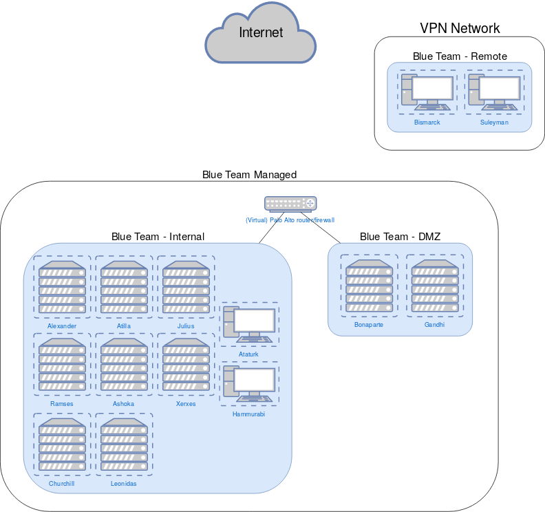

# bluemangroup

Blue Man Group is the codename for the Blue Team infrastructure component of ISTS17.

## Network Topology

## Host Reference
Notes about "global" services:
- Ping on all hosts
- WinRM on all Windows hosts
- SSH on all Linux/Unix hosts

### Internal Network
Blueteam-managed network  
Supposed to be less public, "trusted"  
Network: 10.X.0.0/24  
Gateway: 10.X.0.254  
| Hostname | Role | IP | OS | Services | Notes |
|----------|------|----|----|----------|-------|
| Alexander | AD/DC | 10.X.0.1 | Windows Server 2016 | LDAP, DNS | GUI install |
| Attila | ??? | 10.X.0.5 | ??? | (Useful service) ||
| Julius | Fileserver, Mail | 10.X.0.2 | Windows Server 2008 R2 | SMTP (hMail), SMB, FTP (existing Ansible role) | GUI install |
| Leonidas | GrayLog | 10.X.0.4 | Kali 2018.2 | HTTP (GrayLog), Elasticsearch API ||

### DMZ Network
Blueteam-managed network  
Publicly-facing services appear on this network
Network: 10.X.1.0/24  
Gateway: 10.X.1.254  
| Hostname | Role | IP | OS | Services | Notes |
|----------|------|----|----|----------|-------|
| Ashoka | VPN | 10.X.1.1 | CentOS 6 | DNS (PowerDNS), OpenVPN, HTTP (Webmin) | Has second interface on Internal network: 10.X.0.6 |
| Bonaparte | Web | 10.X.1.2 | Windows Server 2012 R2 | HTTP/HTTPS (IIS) | Core install |

### VPN Network
Whiteteam-managed network  
Simulates remote workers logging in via VPN  
Network: TBD  
| Hostname | Role | IP | OS | Services | Notes |
|----------|------|----|----|----------|-------|
| Bismark | Client | DHCP | Cucumber Linux |||
| Suleyman | Client | DHCP | Windows 8 |||

### AWS Hosts
Whiteteam-managed network
Network: TBD
| Hostname | Role | IP | OS | Services | Notes |
|----------|------|----|----|----------|-------|
| Churchill | Docker Host | Elastic IP(s) | Ubuntu 18.04 | Docker API | Will run Mattermost, GitLab, etc docker containers.  No containers will be scored. |
