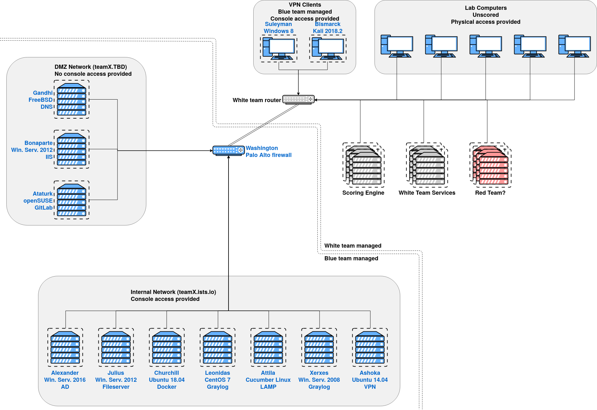

# bluemangroup

Blue Man Group is the codename for the Blue Team infrastructure component of ISTS17.

## Deployment
**Please note** that deployment was performed one team at a time, instead of
deploying against all teams at once. The rest of this guide will assume that
you are also deploying against one team at a time. However, deploying against
all teams at the same time should not be difficult.

For ISTS 17, we deployed 14 teams in total - teams 1-13 were for competitiors,
and team 0 was an unused team for testing deployment and red team activities.
This guide will use team 0 as the example deployment team.

### Prerequisites
Before you can use this repository to deploy any teams, you will need to create
templates for each host in the host reference tables below. In addition, each
template must meet the following requirements:
- 

## Network Topology


## Host Reference
Notes about "global" services:
- Ping on all hosts
- WinRM on all Windows hosts
- SSH on all Linux/Unix hosts

### Internal Network
Blueteam-managed network  
Console access provided  
Network: 10.2.X.0/24  
Gateway: 10.2.X.254  
Domain: teamX.ists.io  

| Hostname    | Role                | IP          | OS                      | Services                | Notes |
|-------------|---------------------|-------------|-------------------------|-------------------------|-------|
| Alexander   | Domain Controller   | 10.2.X.1    | Windows Server 2016     | LDAP, DNS               ||
| Julius      | Fileserver          | 10.2.X.2    | Windows Server 2012 R2  | SMB, FTP                | Roaming user profile host |
| Churchill   | Docker Host         | 10.2.X.3    | Ubuntu 16.04            | Docker API              | Running Mattermost, other containers (unscored) |
| Leonidas    | Graylog             | 10.2.X.4    | CentOS 7                | HTTP, Elasticsearch API | Also OSSEC controller |
| Attila      | Vulnerable Web App  | 10.2.X.5    | Cucumber Linux          | HTTP                    | LAMP stack for injects webapp |
| Xerxes      | Mail                | 10.2.X.6    | Windows Server 2008 R2  | SMTP (hMail)            | Not used for inject delivery |
| Ashoka      | VPN Endpoint        | 10.2.X.7    | Ubuntu 14.04            | OpenVPN                 | Uses 10.X.2.0/24 for VPN clients |
| Bismark     | Client              | DHCP        | Kali 2018.2             |                         ||
| Washington  | Router              | 10.2.X.254  | PAN                     |                         ||

### DMZ Network
Blueteam-managed network  
No console access provided  
Network: 10.3.X.0/24  
Gateway: 10.3.X.254  
Domain: teamX.cybertigers.club  

| Hostname    | Role                | IP          | OS                      | Services                | Notes |
|-------------|---------------------|-------------|-------------------------|-------------------------|-------|
| Gandhi      | Public DNS          | 10.3.X.1    | FreeBSD 11.2            | DNS, HTTP (Webmin)      ||
| Bonaparte   | Public Website      | 10.3.X.2    | Windows Server 2012 R2  | HTTP, HTTPS (IIS)       | Core install |
| Ataturk     | GitLab              | 10.3.X.3    | openSUSE 42.3           | HTTPS, SSH (git)        | GitLab login required for HTTPS check |
| Washington  | Router              | 10.3.X.254  | PAN                     |                         ||

## Running
This section describes how to run the ansible in this repository to deploy the
ISTS 17 defensive infrastructure.

### Single-Team Deployment
To run a deployment for a single team, run:
```bash
ansible-playbook deploy.yml -i inventory.yml -l teamX
```
